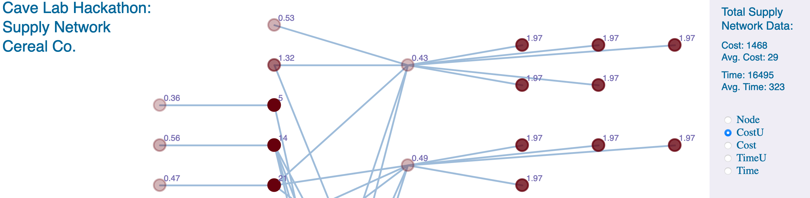

# Interactive Supply-Chain Network

This proyect start in Cave Hackathon at MIT. 
The idea of the proyect is interact with a representation of a supply chain from some company and to see some metrics as the final cost of a product. 

You can see the project up and running at: 
https://guidolo.github.io/Graph-Visualizer/

